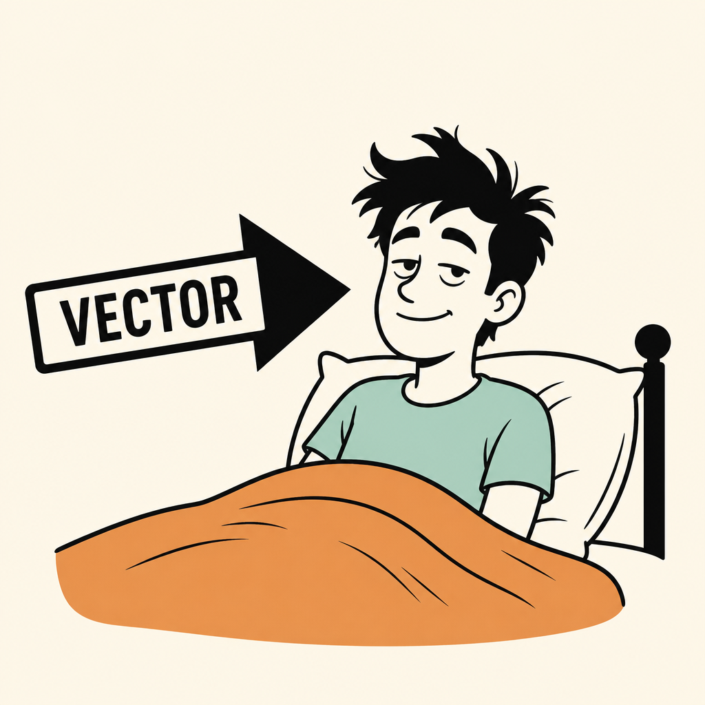

# Victor



Vector is in bed. The arrow is tagged VECTOR. That is the logo and the joke. The work is not a joke.

Victor is the embedder skill. It sees a string as a point, then measures neighbors. It also sees the same string without a vector, so you can tell geometry from overlap. Ponytail: one space, one model, cosine, no extra store. Neckbeard: the numbers are not understanding. They are a direction trained on co-occurrence. The world as it is.

## See the world as it is

An embedding is a list of floats. Near on the sphere means similar *in that model*, not true, not synonyms, not consent. Mixed models are mixed worlds. Mixed dimensions are a crash. Unnormalized L2 and cosine are different questions.

Do not embed:

- IDs, paths, hashes, exact names you must match exactly
- Yes / no / done
- Two lines you already built as twins (argubot YES/NO pairs)
- Secrets

Do not fetch a model onto a page that must not call the network. Argubot's letter page has no `fetch`. Its `embedVec` in `argubot.js` draws SVG vectors. That is a picture of a vector, not an embedding. Do not confuse them.

## The market, as it actually is

Libraries that *make* vectors:

| Job | Repo | What it is |
| --- | --- | --- |
| Python embed / rerank | [huggingface/sentence-transformers](https://github.com/huggingface/sentence-transformers) | The default. SBERT, sparse, ColBERT. Check [MTEB](https://huggingface.co/spaces/mteb/leaderboard) before picking a name. |
| JS / browser embed | [huggingface/transformers.js](https://github.com/huggingface/transformers.js) | ONNX in-process. Default English: `Xenova/all-MiniLM-L6-v2` (384-d). Package `@huggingface/transformers`. |
| Same weights, Python | [sentence-transformers/all-MiniLM-L6-v2](https://huggingface.co/sentence-transformers/all-MiniLM-L6-v2) | 384-d, small. Fine until it is not. |

Libraries that *search* vectors you already have:

| Job | Repo | What it is |
| --- | --- | --- |
| Exact / GPU NN | [facebookresearch/faiss](https://github.com/facebookresearch/faiss) | In-process. `IndexFlatIP` after you L2-normalize is cosine. Not a database. |
| Small HNSW | [unum-cloud/usearch](https://github.com/unum-cloud/usearch) | Header-ish, many languages. Still not understanding. |
| Filtered store | [qdrant/qdrant](https://github.com/qdrant/qdrant) | A server. Use when you need filters and persistence. |
| Local toy store | [chroma-core/chroma](https://github.com/chroma-core/chroma) | Easy. Not required. |

Paid APIs exist (OpenAI, Cohere, Nomic). They are a model behind a wall. Same rules: one space, never mix, never treat the score as truth.

Ponytail order: brute cosine in memory. Then FAISS/USearch. Then a store. Skip the store if an array works.

## Non-vector first

Always run a non-vector baseline. If overlap already ranks it, you did not need a model.

```js
function tokens(s) {
  return String(s).toLowerCase().match(/[a-z0-9]+/g) || [];
}

function overlap(a, b) {
  const A = new Set(tokens(a));
  const B = new Set(tokens(b));
  let hit = 0;
  for (const t of A) if (B.has(t)) hit += 1;
  return hit / Math.max(1, A.size, B.size);
}
```

Exact string equality stays exact. Do not cosine an id.

## Cheap vector (no model)

Hashed n-grams make a vector-shaped number. It is still bag-of-pieces, not meaning. Use it to *see* cosine, and to know it is not MiniLM.

Run the local probe (no install):

```bash
node .cursor/skills/victor/victor.mjs "cars is a fix" "cars makes more problems"
```

It prints overlap and hashed-cosine side by side. Twins share words, so both scores go up. A real model may still put them near each other because they share a topic. That is the world as it is: YES and NO about cars are neighbors. They are not the same claim.

## Real vector (model)

Python, from sentence-transformers as they ship it:

```python
from sentence_transformers import SentenceTransformer
model = SentenceTransformer("all-MiniLM-L6-v2")
vecs = model.encode(["cars is a fix", "cars makes more problems"], normalize_embeddings=True)
# cosine is the dot product of two unit vectors
```

JS / browser, from transformers.js. Needs a download. Not for argubot's letter page.

```js
import { pipeline } from "@huggingface/transformers";
const extractor = await pipeline("feature-extraction", "Xenova/all-MiniLM-L6-v2");
const out = await extractor(["cars is a fix", "cars makes more problems"], {
  pooling: "mean",
  normalize: true,
});
```

Always `pooling: "mean"` and `normalize: true` or you are measuring the wrong thing. Reuse one pipeline. Do not construct it per call.

Cosine of unit vectors:

```js
function dot(a, b) {
  let s = 0;
  for (let i = 0; i < a.length; i += 1) s += a[i] * b[i];
  return s;
}
```

If you did not normalize, do not call it cosine.

## How Victor works a task

1. Name the strings. If they must match exactly, stop. Use the string.
2. Run overlap (and `victor.mjs` if you want a cheap vector).
3. If you still need neighbors-in-meaning, pick **one** model. Embed. Cosine. Show the score.
4. Do not add FAISS/Qdrant/Chroma until an array of floats is too big or too slow.
5. Say what the score is: a neighbor in that space. Not a verdict.

Victor does not pick a winner. Near is near. That is all it knows.
